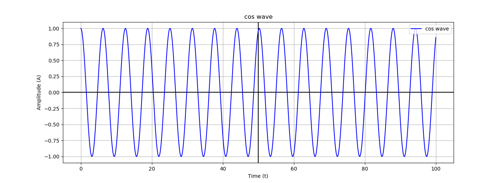
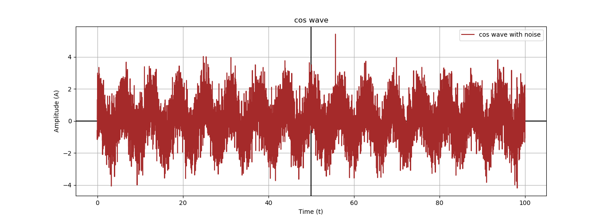
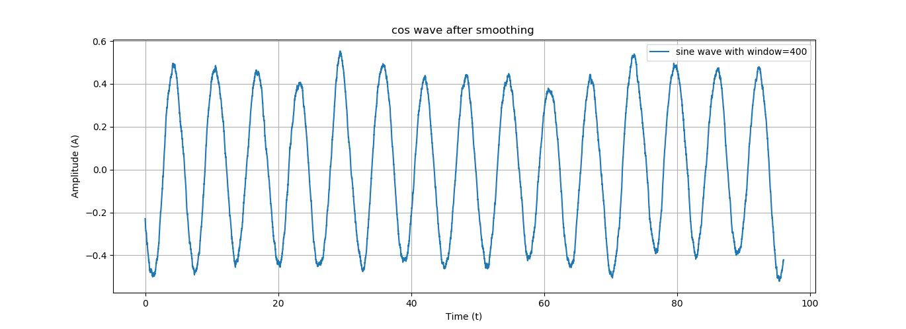

# Signals

#### signals are in everywhere in sound and others and it has many types of them are Analog signal like time, Discrete signal and Digital signal. Every signal is affected by the environment and that lead to produce noise and because noise we cannot analyze the signals so we must use filters to smooth signal and back it to the original status.

#### I implements cosine signal then I add to it noise then I applied the moving average algorithm to smooth the signal. the first graph for signal, the second after the noise and the third graph after filter.

